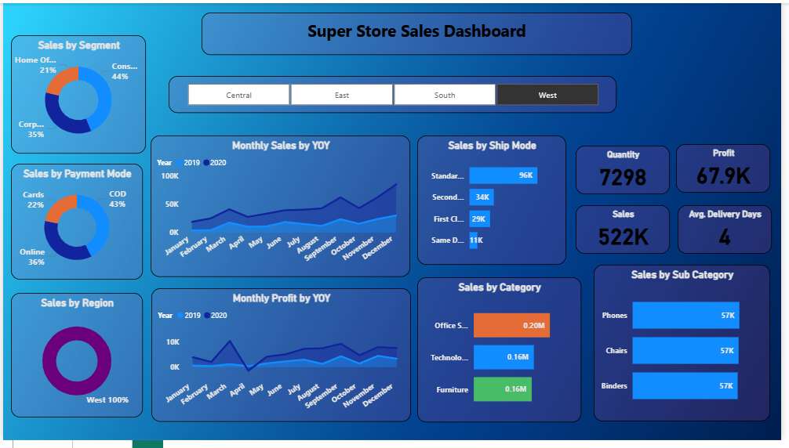

# Super Store Sales Dashboard – Power BI

## 📊 Project Overview
This Power BI dashboard analyzes Super Store sales data, showing trends across regions, categories, and time.

## 🔍 Key Insights
- YOY (Year-over-Year) comparison of monthly sales & profit  
- Sales by segment, category, and payment mode  
- Top-performing subcategories  
- Regional performance filters  
- Key KPIs: Total Sales, Profit, Quantity, Avg Delivery Days  

## 🧠 Tools & Techniques
- Power BI  
- Data Modeling  
- DAX Functions  
- Data Visualization  

## 🖼️ Dashboard Preview

## 🚀 How to View
Download the `.pbix` file and open it in Power BI Desktop.
